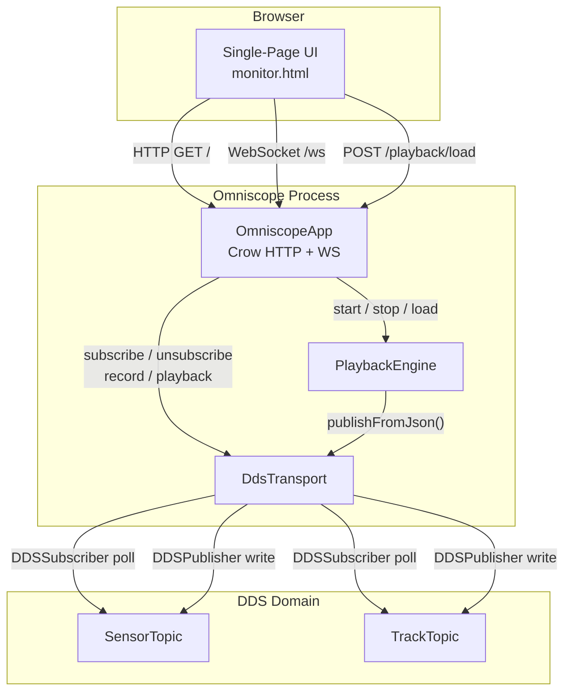
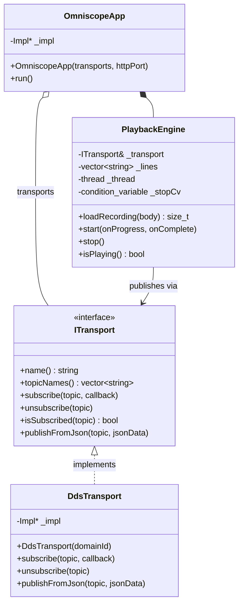
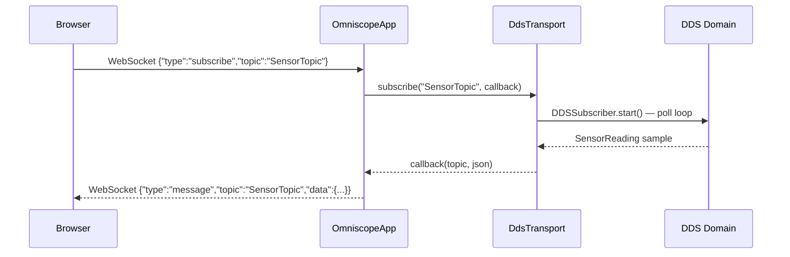
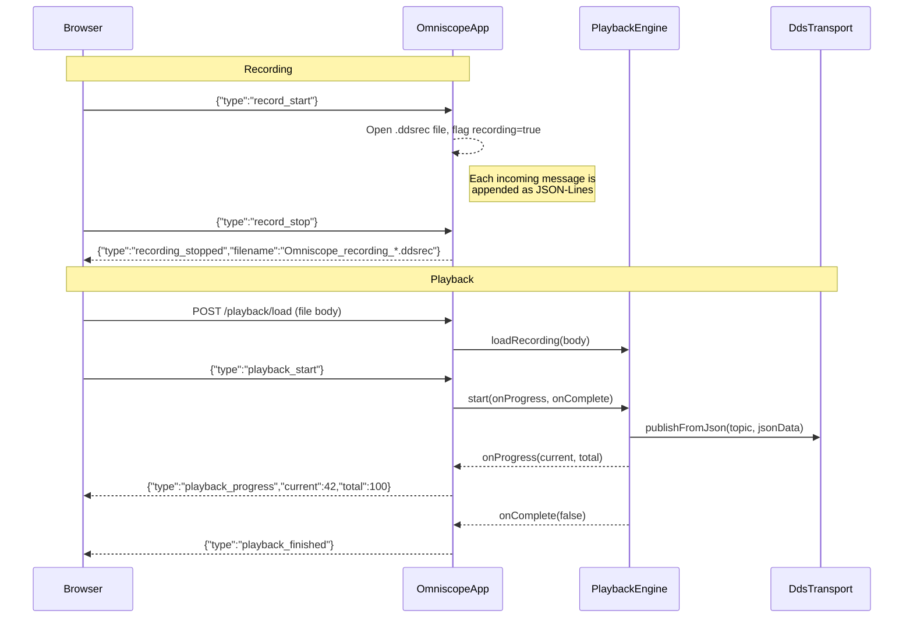
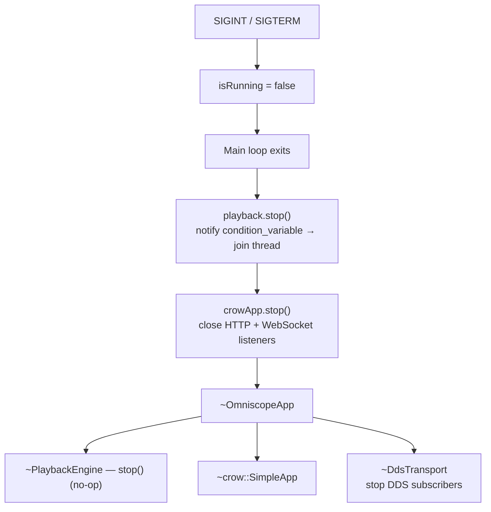

# Omniscope Design

Omniscope is a web-based IPC traffic inspector that lets you monitor,
record, and replay messages flowing through publish-subscribe middleware
in real time from a browser.

## Technology Stack

| Component | Technology | Purpose |
|-----------|-----------|---------|
| **HTTP / WebSocket server** | [Crow](https://crowcpp.org/) 1.3 | Lightweight C++ micro-framework (header-only, BSD-3). Serves the single-page UI and provides the `/ws` WebSocket endpoint for live message streaming. |
| **DDS middleware** | [Eclipse Cyclone DDS](https://cyclonedds.io/) 0.10 | OMG Data Distribution Service implementation used by the default transport. Subscribers poll DDS topics for `SensorReading` and `TrackUpdate` IDL types. |
| **Logging** | [spdlog](https://github.com/gabime/spdlog) (via `GeneralLogger`) | Async structured logging throughout the application. |
| **Build** | CMake 3.25+ / Conan 2 | The HTML UI is embedded at build time via `EmbedHtml.cmake` so the binary is fully self-contained — no external files needed at runtime. |
| **Language** | C++20 | Uses `std::format`, `std::atomic`, `std::jthread`-style patterns, and concepts from the C++20 standard. |
| **Compatibility** | `CrowCompat.h` | Shim that resolves a `std::atomic` / `operator<<` ambiguity when compiling Crow with C++20 / libc++. |

## Architecture



## Class Diagram



## Data Flow

### Live Monitoring



### Recording & Playback



## Shutdown Sequence



Crow's built-in signal handlers are cleared via `signal_clear()` before
`run_async()` so that the application's own `std::signal` handlers
remain in control. The `PlaybackEngine` uses a `std::condition_variable`
for its inter-message sleep so that `stop()` wakes it immediately
rather than blocking up to 5 seconds.

## Transport Extensibility

Omniscope is designed around the `ITransport` interface. Adding a new
transport (e.g. Zyre, ZMQ, MQTT) requires:

1. Create a class that implements `ITransport`.
2. Instantiate it in `main.cpp` and push it into the transports vector.
3. Omniscope discovers topics automatically via `topicNames()`.

No changes to `OmniscopeApp`, `PlaybackEngine`, or the web UI are
necessary.

## WebSocket Protocol

All browser↔server communication (except the initial page load and file
upload) flows over a single WebSocket at `/ws`. Messages are JSON
objects with a `"type"` field:

### Client → Server

| Type | Fields | Description |
|------|--------|-------------|
| `subscribe` | `topic` | Start receiving live messages for a topic |
| `unsubscribe` | `topic` | Stop receiving messages for a topic |
| `record_start` | — | Begin recording incoming messages to disk |
| `record_stop` | — | Stop recording |
| `playback_start` | — | Start replaying the loaded recording |
| `playback_stop` | — | Stop an in-progress playback |

### Server → Client

| Type | Fields | Description |
|------|--------|-------------|
| `topics` | `topics[]` | Full topic list with subscription state (sent on connect and after subscribe/unsubscribe) |
| `message` | `topic`, `timestamp`, `data` | A live or replayed IPC message |
| `recording_started` | — | Acknowledge recording start |
| `recording_stopped` | `filename` | Acknowledge recording stop, return filename |
| `recording_loaded` | `count` | A recording file was uploaded and parsed |
| `playback_started` | `count` | Playback has begun |
| `playback_progress` | `current`, `total` | Periodic progress update |
| `playback_finished` | — | Playback completed normally |
| `playback_stopped` | — | Playback was stopped by the user |

## HTTP Endpoints

| Method | Path | Description |
|--------|------|-------------|
| `GET` | `/` | Serves the embedded single-page HTML UI |
| `POST` | `/playback/load` | Upload a `.ddsrec` JSON-Lines file for playback |

## Recording File Format

Recordings are stored as JSON-Lines (`.ddsrec`), one message per line:

```json
{"topic":"SensorTopic","timestamp":"2026-03-14T12:00:00.123Z","timestamp_ms":1773576000123,"data":{...}}
```

## File Layout

```
src/apps/Omniscope/
├── CMakeLists.txt          # Build config, HTML embedding, link Crow + CycloneDDS
├── CrowCompat.h            # C++20 / libc++ compatibility shim for Crow
├── ITransport.h            # Abstract transport interface
├── DdsTransport.h/.cpp     # Cyclone DDS transport (pImpl)
├── PlaybackEngine.h/.cpp   # Recording playback with original timing
├── OmniscopeApp.h/.cpp     # Crow HTTP/WS orchestrator (pImpl)
├── main.cpp                # Entry point, argument parsing
└── web/
    └── monitor.html        # Single-page browser UI (embedded at build time)
```

## Usage

```bash
# Build
cmake --build --preset debug

# Run with defaults (domain 0, port 8080)
./build/debug/bin/Omniscope

# Run with custom DDS domain and HTTP port
./build/debug/bin/Omniscope 1 9090

# Open in browser
open http://localhost:8080
```

From the browser UI you can:

1. **Subscribe** to any available topic to see live messages.
2. **Record** traffic to a `.ddsrec` file.
3. **Upload** a previous recording and **play it back** through the
   transport, re-publishing each message with original timing.
4. **Stop** playback at any time.

Press **Ctrl+C** in the terminal to shut down cleanly.
